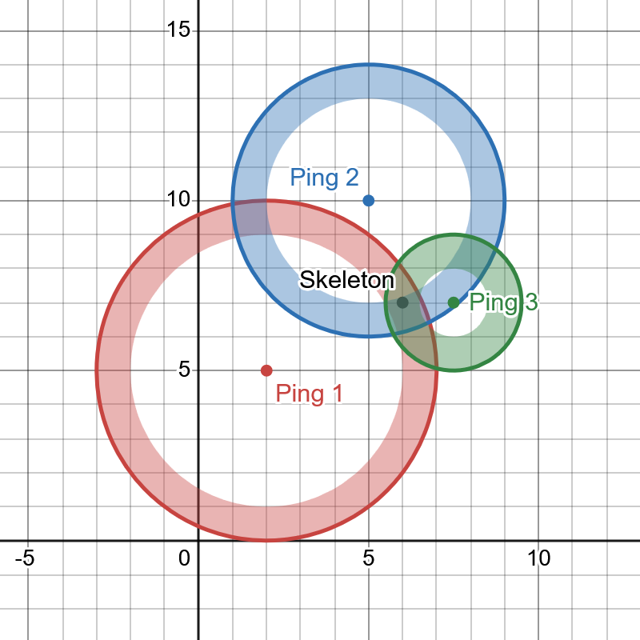

# Ghost Seek Feature

This feature helps players locate Praying Skeletons faster by highlighting the possible locations for it.

## Functionality
The mod will need to capture the type of ghost seek currently active.

1. When the ghost seek is triggered, the origin and type (which indicates the distance range the user is from the skeleton) is recorded. This will be called a ping.
   1. If the ping is more than (Ghost Seek max distance * 2) blocks away from any other pings, a new list is created with the ping inside. The list will be called a sequence.
   2. Otherwise, the ping is added to the sequence which has the ping within reasonable distance to the new ping.
2. When a new ping is created, the origin should be shown to the user along with its type and sequence.
3. Afterward, show a spherical shell / hollow sphere, where...
   1. The origin is the ping's origin,
   2. r, or the inner sphere's radius, is the minimum in the distance range of the ping
   3. R, or the outer sphere's radius, is the maximum in the distance range of the ping
4. If the ping is not the first in the sequence, the intersection between the spherical shells should be shown to the user. This is the region where the skeleton must be within.
5. When the skeleton is claimed, delete any sequence where the possible range contains the skeleton.

# Notes
This algorithm doesn't account for multiple skeletons being less than (Ghost Seek max distance * 2) blocks from each other, causing sequences to "overlap".
Hopefully this doesn't happen too often because I have no clue how to solve this lol

A command could be added to abandon a sequence

A GUI could be added to track the amount of skeletons found and loot obtained, kind of like those Hypixel Skyblock crops per min GUI lol

# Picture

A picture of how the ping and sequence system might work. While the picture works in 2D, it should translate to 3D all the same.

